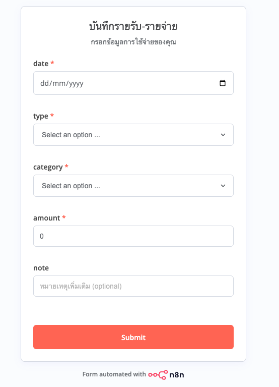

# 💰 Budget Tracker — Automated with n8n + Google Sheets

An automated personal income and expense tracker built with **n8n**, using a web form to collect data and storing it directly into **Google Sheets** with auto-calculated `balance_change` and `running_total`.

---

## 📸 Screenshots

### Web Form (Input)


### n8n Workflow Overview


### Form Submission Result (JSON)


### Google Sheets Output


### JSON Result from n8n


---

## ✨ Features

- Web form auto-generated by n8n — no frontend code needed
- Supports **income** and **expense** entries
- Auto-calculates `balance_change` (+/-) based on transaction type
- Auto-calculates `running_total` (cumulative balance) on every submission
- Auto-records `created_at` timestamp on every submission
- Data stored in Google Sheets — viewable and editable without any tools

---

## 🔧 Tech Stack

| Tool | Purpose |
|---|---|
| [n8n](https://n8n.io) | Workflow automation (self-hosted or cloud) |
| n8n Form Trigger | Web form for data input |
| n8n Set Node | Data transformation + timestamp |
| n8n Code Node (JavaScript) | Calculate `balance_change` and `running_total` |
| Google Sheets | Data storage and visualization |

---

## 🔁 Workflow Structure

```
Form Trigger → Set Fields → Google Sheets (Read) → Code Node → Google Sheets (Append)
```

1. **Form Trigger** — User fills out the form (date, type, category, amount, note)
2. **Set Node** — Maps form fields + adds `created_at` timestamp automatically
3. **Google Sheets (Read)** — Reads all existing rows to get the latest `running_total`
4. **Code Node** — Calculates `balance_change` and `running_total`
5. **Google Sheets (Append)** — Appends a new row with all calculated values

---

## 📊 Google Sheets Schema

| Column | Field | Description |
|---|---|---|
| A | `date` | Transaction date (from form) |
| B | `type` | `income` or `expense` |
| C | `category` | e.g. food, travel, salary |
| D | `amount` | Transaction amount |
| E | `note` | Optional note |
| F | `created_at` | Auto-generated submission timestamp |
| G | `balance_change` | Positive for income, negative for expense |
| H | `running_total` | Cumulative balance up to this row |

---

## 🚀 Getting Started

### Prerequisites
- n8n account (Cloud or self-hosted)
- Google account with Google Sheets access

### Setup Steps

1. **Create a Google Sheet** with headers in row 1:
   ```
   date | type | category | amount | note | created_at | balance_change | running_total
   ```

2. **Connect Google Sheets in n8n**
   - Go to n8n → Credentials → Create credential → Google Sheets OAuth2
   - Sign in with Google (n8n Cloud handles OAuth automatically)

3. **Import the workflow**
   - Download `workflow.json` from this repo
   - In n8n → Workflows → Import from file → select `workflow.json`

4. **Update the Google Sheets node**
   - Open the workflow → click the Google Sheets nodes
   - Select your Spreadsheet and Sheet name

5. **Activate the workflow**
   - Toggle the workflow to **Active**
   - Copy the Form URL and share it

---

## 💡 Code Node — Running Total Logic

```javascript
const existingRows = $('Get row(s) in sheet').all();

let lastRunningTotal = 0;
for (let i = existingRows.length - 1; i >= 0; i--) {
  const val = parseFloat(existingRows[i].json.running_total);
  if (!isNaN(val) && existingRows[i].json.running_total !== '') {
    lastRunningTotal = val;
    break;
  }
}

const newItem = $('Set fields').first().json;
const amount = parseFloat(newItem.amount);
const balance_change = newItem.type === 'income' ? amount : -amount;
const running_total = lastRunningTotal + balance_change;

return [{
  json: {
    date: newItem.date,
    type: newItem.type,
    category: newItem.category,
    amount: amount,
    note: newItem.note,
    created_at: newItem.created_at,
    balance_change: balance_change,
    running_total: running_total,
  }
}];
```

---

## ⚠️ Limitations & Notes

### n8n Cloud (Free Trial)
- The free trial includes **1,000 executions** — sufficient for personal use and practice
- After the trial ends, a **paid plan is required** to keep the workflow active on n8n Cloud
- **Alternative:** Self-host n8n for free on your own machine or a VPS

### Google Sheets as a Database
- Google Sheets works well for personal use and small datasets
- Performance may degrade with very large datasets (100,000+ rows)
- Not suitable for multi-user concurrent writes at high frequency
- For production-scale needs, consider migrating to a proper database (PostgreSQL, MySQL, etc.)

### Connecting a Real Database (Optional / Paid Tools May Apply)
- If you want to store data in a local MySQL or PostgreSQL database, you will need to expose your local database to the internet
- Tools like **ngrok** (free tier requires credit card for TCP tunnels) or **Cloudflare Tunnel** (free) can be used
- This adds complexity and is **not required** for personal budget tracking
- Recommended only if you are practicing database integration or building a more scalable system

### Running Total Accuracy
- The `running_total` is calculated at the time of form submission
- If you manually edit or delete rows in Google Sheets, the running total will not auto-recalculate for past rows — you will need to update them manually

---

## 📁 Repository Structure

```
budget-tracker-n8n/
├── README.md
├── workflow.json          # n8n workflow export
└── images/
    ├── Form_example.png
    ├── Example_workflow.png
    ├── After_submit_form_result_example.png
    ├── Excel_sheet_example.png
    └── Json_result_example.png
```

---

## 📝 License

This project is open source and available for personal and educational use.
